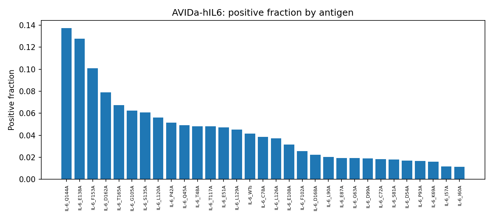
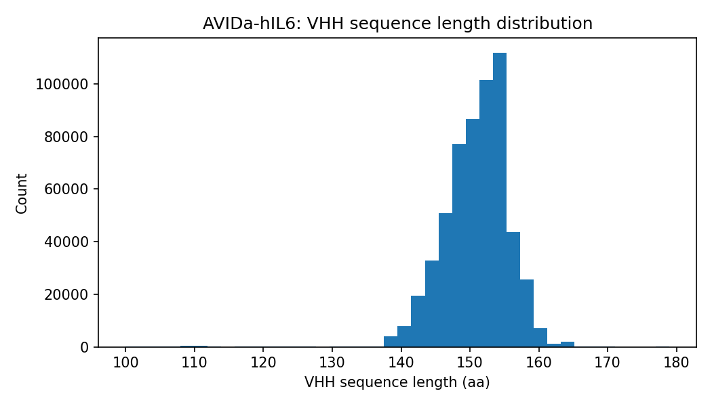
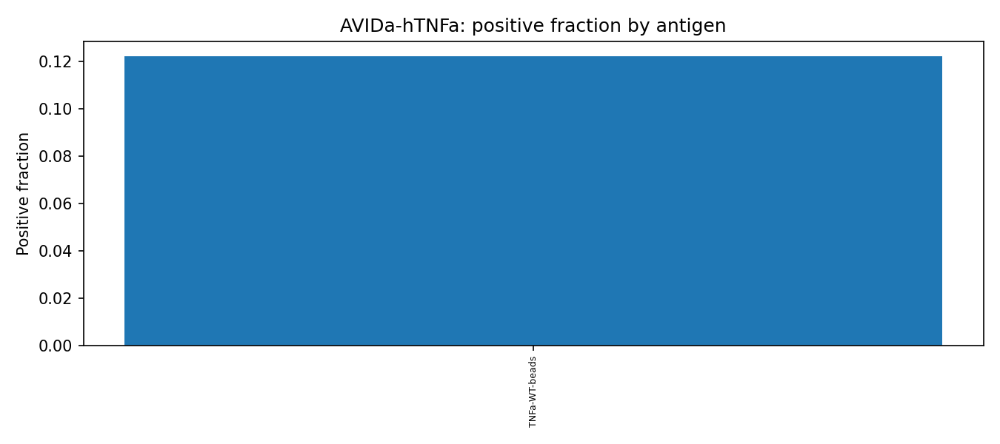
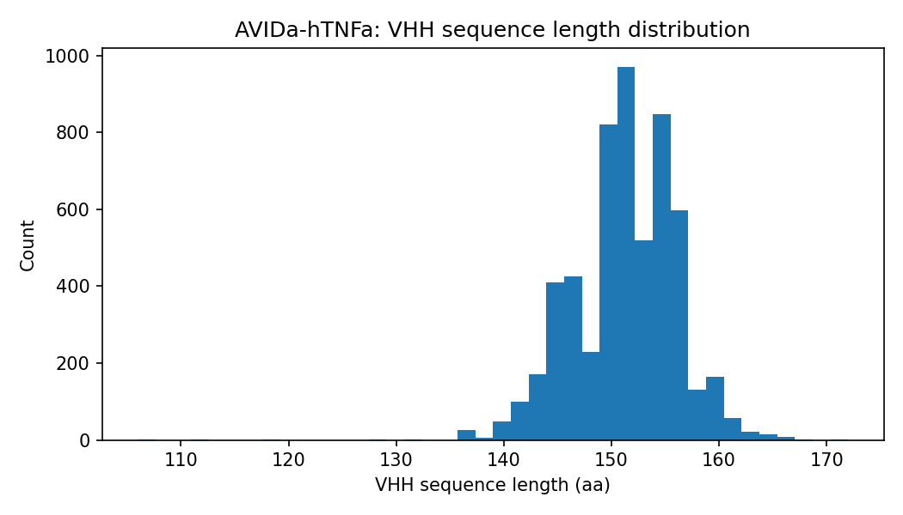

# EDA — Antibody-antigen (AVIDa)

**Generated:** 2026-07-09 | **Source:** `rawdata/avida/` (see `SOURCE.md`)

## Overview
| dataset   |   n_rows |   n_antigens |   positive_fraction |   n_duplicate_rows |   n_duplicate_vhh_seqs |   n_missing_values |   vhh_length_min |   vhh_length_median |   vhh_length_max |
|:----------|---------:|-------------:|--------------------:|-------------------:|-----------------------:|-------------------:|-----------------:|--------------------:|-----------------:|
| hIL6      |   573891 |           31 |              0.0366 |                  0 |                 535292 |                  0 |              100 |                 152 |              179 |
| hTNFa     |     5580 |            1 |              0.1222 |                  0 |                      3 |                  0 |              106 |                 152 |              172 |

## hIL6: positive fraction by antigen (31 antigens)

| Ag_label   |   positive_fraction |   n_rows |
|:-----------|--------------------:|---------:|
| IL-6_Q144A |           0.137457  |    10265 |
| IL-6_E138A |           0.127757  |    10974 |
| IL-6_F153A |           0.100968  |    11469 |
| IL-6_D162A |           0.0790238 |    12047 |
| IL-6_T165A |           0.0674189 |    14002 |
| IL-6_G105A |           0.0623193 |    13832 |
| IL-6_S135A |           0.0608302 |    16357 |
| IL-6_L120A |           0.0560734 |    13411 |
| IL-6_P42A  |           0.0514412 |    18040 |
| IL-6_Q45A  |           0.0492366 |    16898 |
| IL-6_T48A  |           0.0482252 |    18227 |
| IL-6_T117A |           0.0480298 |    15303 |
| IL-6_E51A  |           0.0470847 |    17734 |
| IL-6_L129A |           0.0449952 |    13557 |
| IL-6_WTs   |           0.0414747 |    13020 |
| IL-6_C78A  |           0.0384224 |    13768 |
| IL-6_L126A |           0.0373102 |    13964 |
| IL-6_E108A |           0.0315976 |    19780 |
| IL-6_F102A |           0.0255824 |    24040 |
| IL-6_D168A |           0.0222932 |    12515 |
| IL-6_L90A  |           0.0203351 |    12294 |
| IL-6_E87A  |           0.019359  |    26241 |
| IL-6_G63A  |           0.0192898 |    27683 |
| IL-6_D99A  |           0.0189417 |    23018 |
| IL-6_C72A  |           0.0181832 |    25518 |
| IL-6_S81A  |           0.0178741 |    25344 |
| IL-6_D54A  |           0.0168582 |    29244 |
| IL-6_P93A  |           0.0164609 |    20898 |
| IL-6_K69A  |           0.0159277 |    27562 |
| IL-6_I57A  |           0.0117882 |    28503 |
| IL-6_I60A  |           0.0112391 |    28383 |

## hTNFa: positive fraction by antigen (1 antigens)

| Ag_label      |   positive_fraction |   n_rows |
|:--------------|--------------------:|---------:|
| TNFa-WT-beads |            0.122222 |     5580 |

## Subject metadata

- **hIL6**: 1 subject alpaca (`wizzy`, male) — all 573,891 rows from a single immunized animal.

- **hTNFa**: 2 subject alpacas (1 male, 1 female) — 5,580 rows split across both.

## Figures

## Notes

- Column order differs between the two CSVs (`label`/`Ag_label` swapped) — read by column name, not position.

- hTNFa has only 1 antigen (`TNFa-WT-beads`), so its "by antigen" breakdown is a single row — included for consistency with hIL6, not because it's informative on its own.

- hTNFa is ~100x smaller than hIL6 (5,580 vs 573,891 pairs) and comes from 2 subjects vs 1 — direct comparison of statistics between the two datasets should account for this scale difference.

- **hIL6's high VHH-sequence "duplicate" count (535,292/573,891) is expected, not a data-quality issue**: only 38,599 VHH sequences are unique, each tested against a median of 14 (up to all 31) antigen variants — one row per (VHH, antigen) combination, by design.
