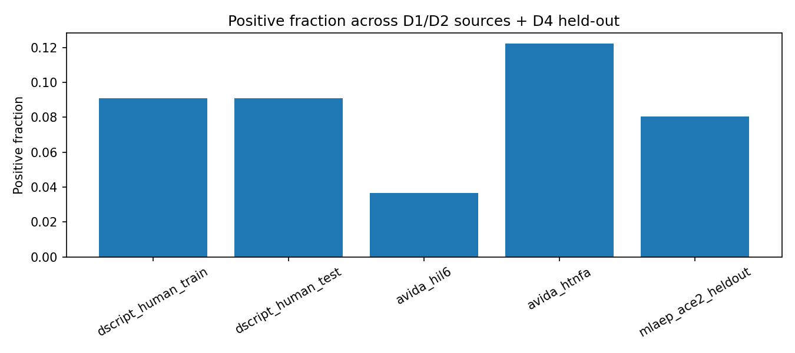
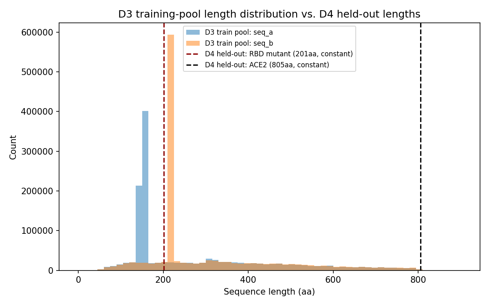
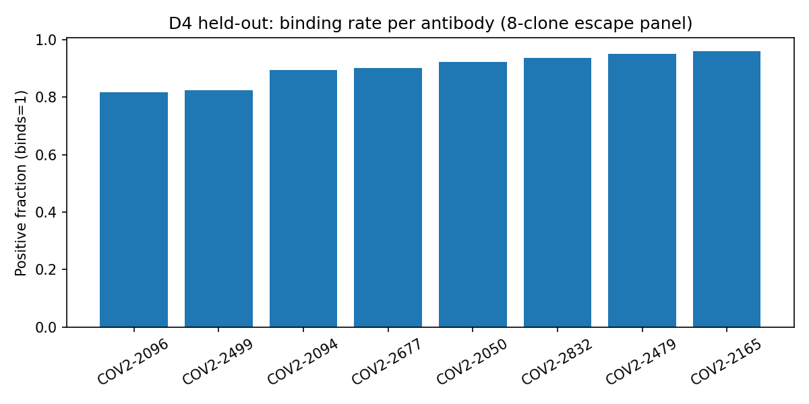

# EDA — Combined dataset variants (D1-D4)

**Generated:** 2026-07-09 | **Source:** `rawdata/combined/` (built by `src/spikes/build_combined_datasets.py`)

D1 = D-SCRIPT PPI (all species). D2 = AVIDa, no COVID (hIL6+hTNFa). D3 = D1 union D2 (training pool). D4 = D3 as the training pool, with MLAEP reframed as a held-out evaluation partition — not merged into D3 — covering two kinds of viral-domain generalization: (a) RBD mutant paired with human ACE2 (`ace2_bind` label), and (b) RBD mutant paired with each of an 8-antibody escape panel (VH/VL sourced from CoV-AbDab, originally Zost et al. 2020), label flipped to `1=binds` for consistency.

## Row counts & positive fraction by source

### D1 (PPI)

| source_dataset      |   positive_fraction |   n_rows |
|:--------------------|--------------------:|---------:|
| dscript_ecoli_test  |           0.0909091 |    22000 |
| dscript_fly_test    |           0.0909091 |    55000 |
| dscript_human_test  |           0.0909246 |    52725 |
| dscript_human_train |           0.0909074 |   421792 |
| dscript_mouse_test  |           0.0909091 |    55000 |
| dscript_worm_test   |           0.0909091 |    55000 |
| dscript_yeast_test  |           0.0909091 |    55000 |

### D2 (AVIDa)

| source_dataset   |   positive_fraction |   n_rows |
|:-----------------|--------------------:|---------:|
| avida_hil6       |           0.0365575 |   573891 |
| avida_htnfa      |           0.122222  |     5580 |

### D4 held-out (MLAEP/ACE2)

| source_dataset     |   positive_fraction |   n_rows |
|:-------------------|--------------------:|---------:|
| mlaep_ace2_heldout |           0.0804934 |    19132 |

### D4 held-out (MLAEP/8-antibody panel)

| source_dataset          |   positive_fraction |   n_rows |
|:------------------------|--------------------:|---------:|
| mlaep_cov2-2050_heldout |            0.923009 |    19132 |
| mlaep_cov2-2094_heldout |            0.895463 |    19132 |
| mlaep_cov2-2096_heldout |            0.818001 |    19132 |
| mlaep_cov2-2165_heldout |            0.959231 |    19132 |
| mlaep_cov2-2479_heldout |            0.951443 |    19132 |
| mlaep_cov2-2499_heldout |            0.825057 |    19132 |
| mlaep_cov2-2677_heldout |            0.902833 |    19132 |
| mlaep_cov2-2832_heldout |            0.936232 |    19132 |

### D3 (D1 union D2) by pair_type

| pair_type        |   positive_fraction |   n_rows |
|:-----------------|--------------------:|---------:|
| antibody_antigen |           0.0373824 |   579471 |
| ppi              |           0.0909092 |   716517 |

## Sequence length stats (seq_a / seq_b) per variant

| dataset                 |   seq_a_min |   seq_a_median |   seq_a_max |   seq_b_min |   seq_b_median |   seq_b_max |
|:------------------------|------------:|---------------:|------------:|------------:|---------------:|------------:|
| D1                      |          50 |            344 |         800 |          50 |            350 |         800 |
| D2                      |         100 |            152 |         179 |         218 |            218 |         233 |
| D3                      |          50 |            158 |         800 |          50 |            218 |         800 |
| D4-heldout (ACE2)       |         201 |            201 |         201 |         805 |            805 |         805 |
| D4-heldout (antibodies) |         201 |            201 |         201 |         225 |            233 |         241 |

## Held-out cleanliness (D4)

- ACE2 sequence present in D1 (training pool)? **False**

- ACE2 sequence present in D2 (training pool)? **False**

- RBD mutant sequences overlapping D1: **0**/19132

- RBD mutant sequences overlapping D2: **0**/19132

- **Result: zero overlap in both directions — D4's held-out partition is genuinely clean, not contaminated by anything in the D3 training pool.**

**Cross-dataset fact (D1 vs D2):** 1 sequence is shared between D1 and D2 — human TNF-alpha's sequence (length 233) appears both as a generic PPI protein in D1 and as the antigen in AVIDa-hTNFa in D2. Not a leakage concern (D1/D2 are both part of the same training pool D3), just a notable overlap in subject matter between the two source datasets.

**Length distribution shift:** D1's training proteins are capped at 800aa max, but D4's held-out ACE2 sequence is **805aa — 5 residues longer than anything seen in D1 training**. A minor but real out-of-distribution point: the held-out set isn't just a new domain, it also touches a sequence length just past the edge of the training distribution.

## 8-antibody escape panel (D4 held-out, second held-out axis)

VH/VL for all 8 named antibody clones (`COV2-2050/2096/2094/2677/2479/2165/2499/2832`) were unavailable from the MLAEP data itself or from direct patent/PDB/GenBank search, but were found in **CoV-AbDab** (Oxford OPIG's curated coronavirus antibody database), correctly cited there to the original source (Zost et al. 2020, *Nature Medicine*). `seq_b` = VH + `/` + VL (explicit separator; VH and VL are two distinct polypeptide chains, not a fused construct). MLAEP's native `COV2-*_400` columns are escape indicators (1 = antibody fails to bind); flipped here to `1 = binds` for consistency with D1-D3.

- Antibody sequences (8 unique) overlapping D1/D2 training pool: **0** / **0**

- RBD mutant sequences (paired with antibodies) overlapping D1/D2: **0** / **0**

- **Result: zero overlap in both directions here too — this second held-out axis is equally clean.**

**Positive fraction (binds=1) per antibody** — inverse of escape rate; most mutants still bind most antibodies (single/double substitutions rarely fully disrupt binding):

| antibody   |   positive_fraction(binds) |   n_rows |
|:-----------|---------------------------:|---------:|
| COV2-2096  |                   0.818001 |    19132 |
| COV2-2499  |                   0.825057 |    19132 |
| COV2-2094  |                   0.895463 |    19132 |
| COV2-2677  |                   0.902833 |    19132 |
| COV2-2050  |                   0.923009 |    19132 |
| COV2-2832  |                   0.936232 |    19132 |
| COV2-2479  |                   0.951443 |    19132 |
| COV2-2165  |                   0.959231 |    19132 |

**D3 duplicate rows:** 3,886 exact duplicate rows; 3,950 duplicate (seq_a, seq_b) pairs ignoring label — inherited mostly from D1's known `ecoli_test.tsv` duplicate rows (see `docs/eda-ppi.md`), not a new issue introduced by combining.

**Vocabulary check (D4 held-out, ACE2 axis):** ACE2 non-standard residues: none. RBD mutants with non-standard residues: 0/19132. Fully standard-alphabet.

**Vocabulary check (D4 held-out, antibody axis):** non-standard residues across all 8 VH/VL sequences (excluding the `/` separator): none. Fully standard-alphabet.

## Figures

## Notes

- **Column semantics differ by source within D3**: in D1 (PPI), `seq_a`/`seq_b` are symmetric generic proteins; in D2 (AVIDa), `seq_a` is specifically the antibody (VHH) and `seq_b` is specifically the antigen — an asymmetric role. A model trained on D3 should be aware `seq_a`/`seq_b` don't mean the same thing across `pair_type`; consider adding an explicit role indicator if this matters for the chosen architecture.

- D4's held-out set has **zero sequence-length variance** (every RBD mutant is exactly 201aa; ACE2 is a constant 805aa) — the length-confound check from Phase 1 (varying positive fraction by pair length) mechanically cannot manifest in this held-out set, since there's no length variation to correlate with.
