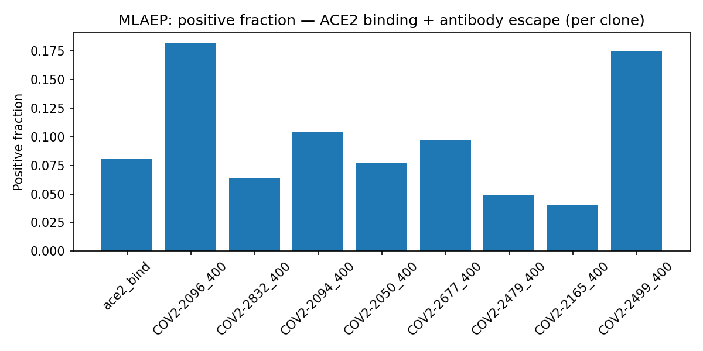
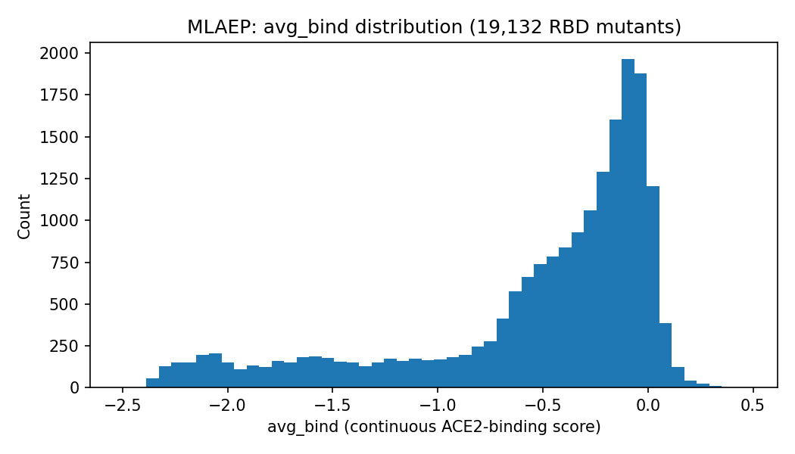

# EDA — Viral antigenic evolution (MLAEP)

**Generated:** 2026-07-09 | **Source:** `rawdata/mlaep/` (see `SOURCE.md`)

MLAEP bundles 7 heterogeneous files rather than one interaction table. "Positive fraction" is reported where a natural binary label exists (`GMM_covid_info_seq.csv`); other files get descriptive stats matching their shape.

## GMM_covid_info_seq.csv — deep mutational scan (19,132 RBD mutants)

- Rows: 19,132 | Missing values: 0 | Duplicate `seq` rows: 0

- `seq` length: all 1 unique value(s) — min 201, max 201 (RBD mutants are all point/double substitutions of a fixed-length reference)

- `avg_bind` (continuous binding score): mean=-0.534, std=0.614, min=-2.505, max=0.470

**Positive fraction — binary columns** (`ace2_bind` = binds ACE2; `COV2-*_400` = escapes that antibody clone at 1:400 dilution):

| column        |   positive_fraction |
|:--------------|--------------------:|
| ace2_bind     |              0.0805 |
| COV2-2096_400 |              0.182  |
| COV2-2832_400 |              0.0638 |
| COV2-2094_400 |              0.1045 |
| COV2-2050_400 |              0.077  |
| COV2-2677_400 |              0.0972 |
| COV2-2479_400 |              0.0486 |
| COV2-2165_400 |              0.0408 |
| COV2-2499_400 |              0.1749 |

## pVNT.csv + pVNT_seq.csv — named high-risk-variant neutralization data

- 15 named variant/mutation combinations, 15 matching RBD sequences.

- `Reduction` (fold-reduction in neutralization titer vs wild-type): min=-9.28, median=34.22, max=97.52

- 2 entries have **negative** reduction (i.e. enhanced neutralization vs WT) — not an error, just means those mutants are neutralized more effectively.

- Missing `WHO ` (variant Greek-letter name) for 5/15 rows (unnamed/minor lineages).

## sars-cov-2_variants_update.csv — named variant panel

- 7 entries: Alpha, Beta, Gamma, Delta, Omicron, Omicron, wt

- Note: 2 rows both named `Omicron` (lineages `B.1.1.529` and `BA.2`) — sub-lineage distinction, not a duplicate.

## site_class.csv — RBD site structural/epitope classification

- 201 sites classified.

| class   |   n_sites |
|:--------|----------:|
| n       |       126 |
| 4       |        24 |
| 3       |        23 |
| 1       |        14 |
| 2       |         9 |
| 1+2     |         5 |

- ACE2-contact flag set (non-null) for 17/201 sites (8.5%).

## Covid19_RBD_seq.txt — reference RBD sequence

- Single reference sequence (Wuhan-Hu-1 RBD), length 201 aa.

## merged_all.jsonl — generic protein structures (not SARS-CoV-2-specific)

- 18 structures (seq + backbone coordinates). Sequence length: min=80, median=110, max=130.

- Likely the structural-model training/reference set (per MLAEP's multi-task architecture), distinct in kind from the other 6 COVID-specific files — no interaction/binding label, so "positive fraction" doesn't apply here.
