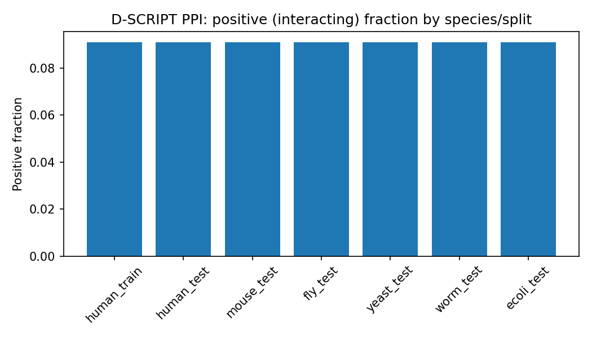
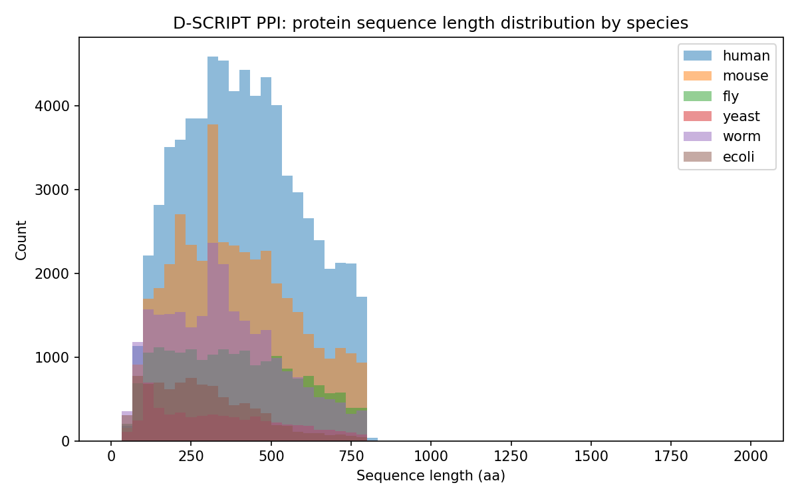

# EDA — PPI (D-SCRIPT)

**Generated:** 2026-07-09 | **Source:** `rawdata/ppi/` (see `SOURCE.md`)

## Positive fraction & row counts by dataset/species

| dataset     |   n_rows |   positive_fraction |   n_unique_proteins |   n_duplicate_rows |   n_missing_values |
|:------------|---------:|--------------------:|--------------------:|-------------------:|-------------------:|
| human_train |   421792 |              0.0909 |               15816 |                  0 |                  0 |
| human_test  |    52725 |              0.0909 |               15525 |                  0 |                  0 |
| mouse_test  |    55000 |              0.0909 |               37497 |                  0 |                  0 |
| fly_test    |    55000 |              0.0909 |               19213 |                  0 |                  0 |
| yeast_test  |    55000 |              0.0909 |                5664 |                  0 |                  0 |
| worm_test   |    55000 |              0.0909 |               25429 |                  0 |                  0 |
| ecoli_test  |    22000 |              0.0909 |                7138 |               3761 |                  0 |

## Sequence length distribution by species

| species   |   n_sequences |   length_min |   length_median |   length_mean |   length_max |
|:----------|--------------:|-------------:|----------------:|--------------:|-------------:|
| human     |         70529 |           50 |             406 |         415.5 |          800 |
| mouse     |         40606 |           50 |             370 |         392.4 |          800 |
| fly       |         19310 |           50 |             376 |         388   |          800 |
| yeast     |          5664 |           50 |             314 |         341.5 |          800 |
| worm      |         25930 |           50 |             335 |         351.8 |          800 |
| ecoli     |          8848 |           50 |             262 |         286.5 |          799 |

## Duplicate sequences (identical seq, different protein ID)

- human: 54898 duplicate sequence(s)

- mouse: 22689 duplicate sequence(s)

- fly: 7966 duplicate sequence(s)

- yeast: 73 duplicate sequence(s)

- worm: 7575 duplicate sequence(s)

- ecoli: 4436 duplicate sequence(s)

## Figures

## Notes

- Label column normalized to int (source files mix `0`/`1` and `0.0`/`1.0` formatting across species).

- `n_unique_proteins` counts proteins referenced in that species' pair file(s), not the full species fasta (which may include unpaired proteins).

- **Positive fraction is exactly ~0.0909 (1/11) for every species and split** — indicates the D-SCRIPT benchmark uses a fixed 1:10 positive:negative sampling ratio by construction, not an incidental class imbalance.

- **Sequence lengths are hard-capped in [50, 800] aa** for every species — a deliberate preprocessing filter in the source data, not a natural distribution tail.

- **Large fraction of duplicate sequences** (same amino-acid sequence under different protein IDs) — e.g. human: 54,898/70,529 (78%), mouse: 22,689/40,606 (56%). Likely reflects transcript-isoform redundancy in the underlying STRING/Ensembl protein set rather than a data error; worth accounting for if training on this data (isoform duplicates could leak between train/test).

- `ecoli_test.tsv` has 3,761 duplicate **rows** (exact pair+label duplicates) out of 22,000 — unlike any other species file (all had 0). Worth flagging if using ecoli as a held-out test set.
