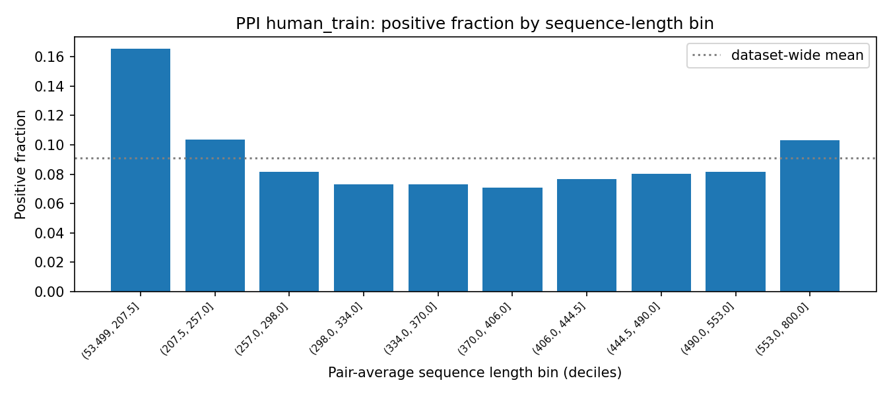
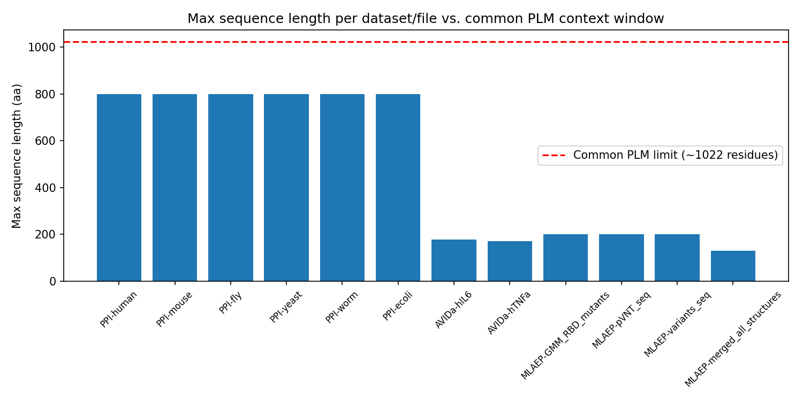

# Phase 1 EDA Summary — dax-gen_project

**Date:** 2026-07-09
**Scope:** Descriptive EDA of 3 independent, curated datasets (PPI, antibody-antigen, viral antigenic evolution), kept separate per spec. Downstream modeling task not yet decided; this report is meant to inform that decision.
**Sources:** `docs/eda-{ppi,avida,mlaep}.md` (per-dataset detail), `docs/phase1_eda_walkthrough.ipynb` (interactive, includes independent exclusion re-verification + PLM-readiness checks).

---

## TL;DR

1. **Highest-priority finding: PPI's train/test split leaks at the protein level.** 100% of `human_test`'s proteins (by ID and by exact sequence) already appear in `human_train`. It's a pair-level split, not a protein-level split — a PLM evaluated on this "test" set is being tested on new *pairings* of already-seen proteins, not on genuinely novel proteins. 89/52,725 test pairs (0.17%) are exact train-pair duplicates. See §2.
2. **PPI's positive fraction is also confounded with sequence length**, not just species. A real shortcut-learning risk for a length-sensitive model. See §3.
3. **Class balance is engineered, not biological, for two of three datasets.** PPI is fixed at ~9.09% positive across every species (a 1:10 sampling ratio baked into the D-SCRIPT benchmark). AVIDa varies substantially by antigen (1.1%–13.7% for hIL6's 31 variants).
4. **All exclusions hold**, independently re-verified: 0 COVID/coronavirus hits in the PPI dataset (plus only one negligible non-functional pseudogene antibody-gene hit, kept per your call); 0 SARS-CoV-2 rows in either AVIDa file.
5. **No PLM context-window issues** — every sequence across all three datasets is well under the ~1022-residue limit common to ESM-2/ESM-1b/ProtBert (max is 800aa, in PPI).
6. **Data-quality caveats worth carrying forward:** heavy sequence-level duplication in PPI from isoform redundancy (56–78% of sequences — this is what drives the identity leakage in §2); non-standard `U`/`X` residues in ~0.1–0.3% of PPI sequences (AVIDa/MLAEP are fully standard-alphabet); label formatting was inconsistent across PPI's per-species files (normalized in all analysis code).

---

## 1. Per-dataset numbers

| Dataset | Rows | Positive fraction | Notes |
|---|---|---|---|
| PPI (D-SCRIPT), all species | 421,792 (human_train) down to 22,000 (ecoli_test) | **~9.09%**, identical across every species/split | Fixed 1:10 sampling ratio by construction |
| AVIDa-hIL6 | 573,891 | **3.66%** overall, 1.1%–13.7% by antigen (31 antigens) | 38,599 unique VHH clones × up to 31 antigen variants each |
| AVIDa-hTNFa | 5,580 | **12.22%** (single antigen) | ~100x smaller than hIL6, 2 subject alpacas vs. hIL6's 1 |
| MLAEP (`GMM_covid_info_seq.csv`) | 19,132 RBD mutants | **8.05%** ACE2-binding; 4.1%–18.2% per antibody-clone escape (8 clones) | Only one of MLAEP's 7 files with a natural binary label |

The other 6 MLAEP files (`pVNT.csv`, `pVNT_seq.csv`, `sars-cov-2_variants_update.csv`, `site_class.csv`, `Covid19_RBD_seq.txt`, `merged_all.jsonl`) are small reference/lookup tables or generic structural data without an interaction label — see `docs/eda-mlaep.md` for their descriptive stats.

---

## 2. Train/test identity-leakage finding (PPI) — highest priority

The question: does `human_test.tsv` contain proteins a model would already have seen while training on `human_train.tsv`? A PLM embeds sequences directly, so if a test protein's exact sequence was in training, the model can succeed via recognition rather than generalization.

**Result: 100% of `human_test`'s 15,525 unique proteins — by protein ID *and* by exact sequence — already appear in `human_train`.** Zero test proteins are genuinely unseen. This means the split holds out specific *pairings*, not proteins: every protein in the test set was already presented to the model during training, just in different pair combinations. Additionally, 89/52,725 test pairs (0.17%) are exact duplicates of a train pair (same two sequences, same label).

This check only applies to human (the only species with both a train and test file); mouse/fly/yeast/worm/ecoli are test-only files used to evaluate cross-species transfer from a human-trained model, which is a different question.

**Why this matters:** "test performance" on this benchmark, as-is, demonstrates generalization to new *pairings of known proteins*, not to genuinely *novel proteins*. That's a materially weaker claim than a train/test split is usually assumed to support. If the downstream goal includes claiming a PLM-based model generalizes to unseen proteins, this benchmark's built-in split can't be used to demonstrate that — a protein-level held-out split (no protein appearing in both train and test) would need to be constructed separately.

---

## 3. The length-confound finding (PPI)

Positive fraction is flat at ~9.09% across species (by construction), but **not flat across sequence length**: the shortest-pair decile is 0.165 (~1.8x the dataset-wide baseline) and the longest-pair decile is 0.103, while every middle decile sits around 0.07–0.08.

**Why this matters:** if you train a PLM-based classifier on this data, embeddings correlate with sequence length in ways a model can exploit as a shortcut — i.e. it could partly learn "short-or-long pair → predict positive" instead of real interaction signal, and look like it's performing well while actually just recovering this artifact. Concretely: hold out a length-stratified validation split, and/or benchmark against a length-only baseline (e.g. logistic regression on `(len_a, len_b)` alone) to know how much of any future model's performance the length shortcut alone can explain.

AVIDa-hIL6 shows a superficially similar by-length pattern, but it's noisy/non-monotonic rather than a clean trend — more likely confounded with antigen identity (which already varies 1.1–13.7% independent of length) than a genuine length effect. Lower-confidence finding, flagged for awareness rather than as a confirmed risk.

---

## 4. PLM-readiness (given the planned downstream PLM use)

| Check | Result |
|---|---|
| Train/test identity leakage | **PPI: 100% of test proteins already seen in train (§2).** Highest-priority finding — affects how any benchmark result should be interpreted. |
| Label vs. length confound | **PPI: real, §3.** AVIDa-hIL6: noisier, likely antigen-confounded. Not applicable to MLAEP's fixed-length mutants. |
| Context window (~1022 residue common limit) | **Clear everywhere** — max is 800aa (PPI), 201aa (MLAEP RBD), 179aa (AVIDa VHH). No truncation strategy needed. |
| Non-standard residues (`X`, `U`, `B`, `Z`, gaps) | AVIDa and MLAEP: **fully standard-alphabet**. PPI: `U`/`X` present in human (221/70,529 seqs), mouse (217/40,606), fly (8/19,310), worm (1/25,930); yeast/ecoli clean. Likely fine with modern PLM tokenizers, but worth confirming against the specific tokenizer used. |

---

## 5. Data-quality notes (not blockers, but relevant to modeling decisions)

- **PPI sequence duplication**: 56–78% of sequences per species are exact duplicates under different protein IDs — reflects transcript-isoform redundancy in the underlying STRING/Ensembl protein set. This is the direct cause of the identity leakage in §2.
- **`ecoli_test.tsv` has 3,761 duplicate rows** (exact pair+label duplicates) out of 22,000 — unique to this file; every other PPI file has 0.
- **AVIDa-hIL6's "93% duplicate VHH sequence" figure is expected, not an error**: 38,599 unique VHH clones, each tested against a median of 14 (up to all 31) antigen variants — one row per (VHH, antigen) combination by design.
- **Column-order inconsistency**: `AVIDa-hIL6.csv` and `AVIDa-hTNFa.csv` have `label`/`Ag_label` in swapped column order — always read by name, not position.
- **Label formatting inconsistency in PPI**: human files use int `0`/`1`; other species use float `0.0`/`1.0` — already normalized in all analysis code, but worth knowing if writing new code against these files directly.

---

## 6. Recommendations for scoping the downstream task

1. **If the downstream goal includes claiming generalization to novel proteins, don't rely on D-SCRIPT's built-in human train/test split as evidence** — construct a protein-level held-out split (no protein shared between train and test) instead, per §2.
2. **Decide the modeling task with the length confound in mind** — plan from the start to check performance against a length-only baseline, not as an afterthought (§3).
3. **Consider isoform-aware splitting for PPI** in general, given the high duplicate-sequence rate — it's the root cause of both §2 and the redundancy noted in §5.
4. **Confirm PLM tokenizer handling of `U`/`X`** before committing to a specific pretrained PLM, since PPI is the dataset affected.
5. **AVIDa's per-antigen positive-fraction variation (1.1–13.7%)** suggests antigen identity is a meaningful covariate — worth deciding whether the downstream task treats antigens jointly (pooled) or separately (per-antigen models/evaluation).
6. Datasets remain intentionally unmerged per spec — nothing above argues for merging them, but the shared PLM-readiness lens (context window, vocabulary, leakage) is a useful frame if a future phase builds a shared embedding pipeline across all three.

---

*Full technical detail, independent verification code, and additional figures are in `docs/eda-{ppi,avida,mlaep}.md` and `docs/phase1_eda_walkthrough.ipynb`.*
